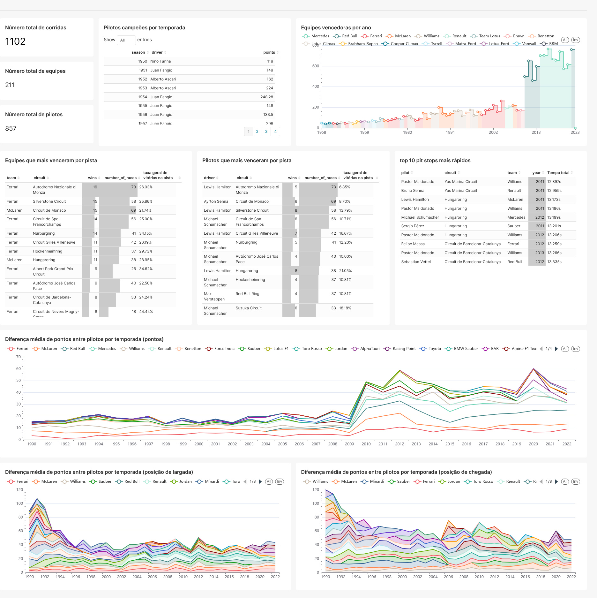

# formula1-dbt

<p>


</p>

Repositorio criado para testar as funcionalidades da ferramenta dbt

## Para iniciar o projeto

Rodando o script `build.sh` irá descompactar o arquivo _.zip_ com as tabelas em formato csv, montar e iniciar os containers do banco e do dbt:

```bash
sh build.sh
```

Após todo o setup estiver pronto basta rodar o comando `dbt seed`, que irá carregar os arquivos _.csv_ em tabelas do banco:

```bash
docker exec -it dbt dbt seed
```

## Para rodar o projeto

Rodar o comando `dbt run` para executar as transformações das tabelas do schema _raw_ para _refined_:

```bash
docker exec -it dbt dbt run
```

Para validar os resultados gerados basta rodar o comando `dbt test`:

```bash
docker exec -it dbt dbt test
```

## Gerando documentação dos _models_

Para gerar e servir localmente a documentação dos models, sources e macros basta rodar os comandos `dbt docs generate` e `dbt docs serve`:

```bash
docker exec -it dbt dbt docs generate
docker exec -it dbt dbt docs serve
```

## Visualizações

Algumas visualizações foram criadas em um dashboard utilizando o [Apache Superset](https://superset.apache.org/). Para acessar basta ir em http://localhost:8088/.


